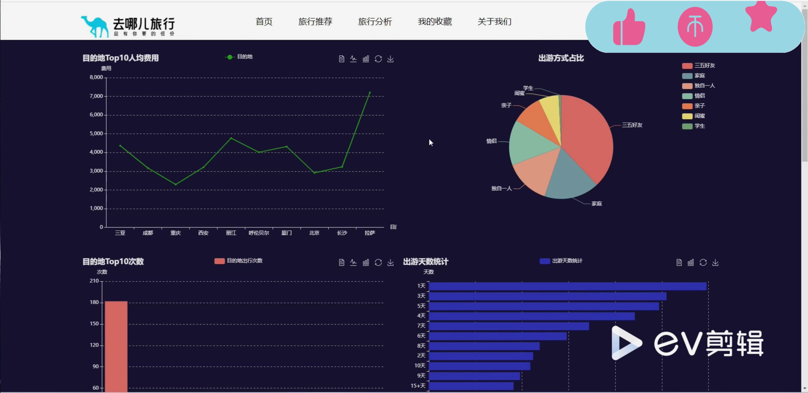
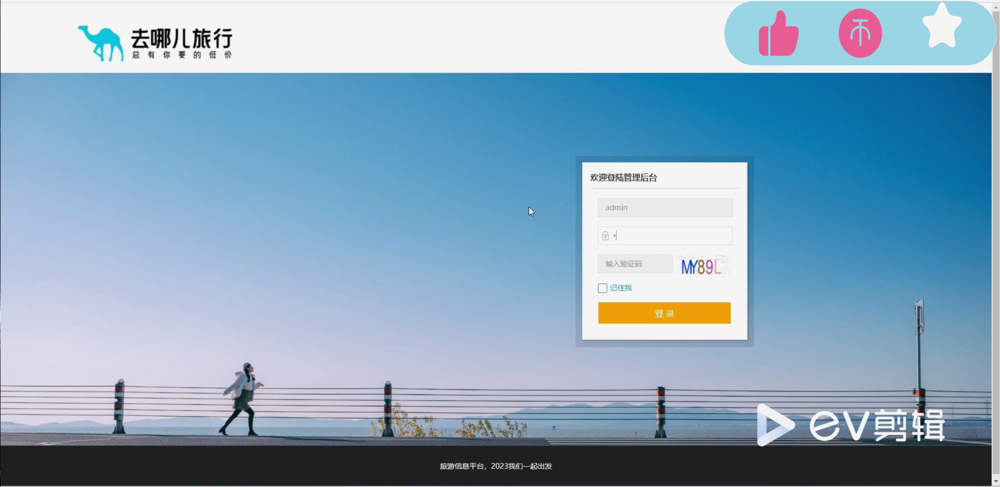
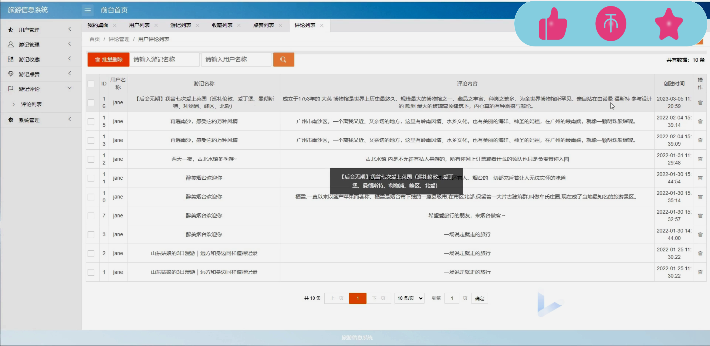

## 计算机毕业设计Hadoop+Spark旅游景点推荐 旅游推荐系统 旅游可视化 景区游客满意度预测与优化 Apriori算法 景区客流量预测 旅游大数据

## 要求
### 源码有偿！一套(论文 PPT 源码+sql脚本+教程)

### 
### 加好友前帮忙start一下，并备注github有偿hadoop旅游推荐25
### 我的QQ号是2827724252或者798059319或者 1679232425或者微信:bysj2023nb 或bysj1688

# 

### 加qq好友说明（被部分 网友整得心力交瘁）：
    1.加好友务必按照格式备注
    2.避免浪费各自的时间！
    3.当“客服”不容易，repo 主是体面人，不爆粗，性格好，文明人。

### 演示视频
https://www.bilibili.com/video/BV1rf421v7YR

### 功能 技术
基于大数据生态体系和SpringBoot开发的旅游出行分析推荐系统
使用selenium进行数据抓取，使用charts实现图表可视化
数据存取使用HDFS和MySQL

### 运行截图

